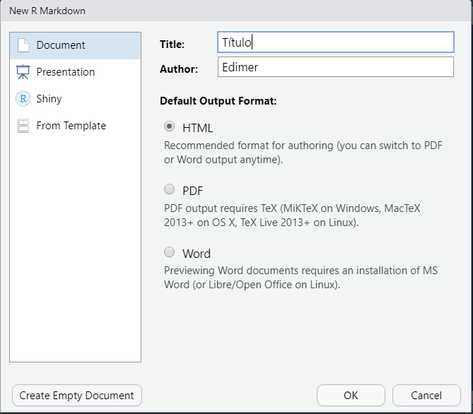

```{r setup, include=FALSE}
options(htmltools.dir.version = FALSE)
```

background-image: url(https://courses.cognitiveclass.ai/asset-v1:BigDataUniversity+RP0101EN+2016+type@asset+block@R-Programming.png)
background-position: 50% 50%
class: center, bottom, inverse

# 

---

# Top lenguajes de programación 2020

<center>

</center>

.footnote[
[Top Programming Languages 2020 - IEEE.](https://spectrum.ieee.org/at-work/tech-careers/top-programming-language-2020)
]

---

# Elementos básicos de R

.pull-left[

### Teclas de acceso rápido

- **`Ctrl + Enter`:** ejecutar código.
- **`Ctrl + L`:** limpiar la consola.
- **`Ctrl + Shift + K`:** compilar documento R Markdown.
- **`Ctrl + Alt + i`:** insertar fragmento de R en documento R Markdown.
- **`Ctrol + Shift + M`:** obtener operador de tubería (`%>%`).

### Codificación UTF-8

- `File -> Save with Encoding -> UTF-8`

]

.pull-right[

### Tipos de datos en R

- Numéricos (`numeric` o `double`)
- Enteros (`integer`)
- Lógicos (`logical`)
- Caracteres (`character`)
- Factores (`factor`)

### Aspectos del lenguaje

- Discrimina minúsculas de mayúsculas
- La asignación se realiza con **`<-`**
- El comentario se estable con numeral (`#`)

]

---
background-image: url(https://www.tidyverse.org/images/tidyverse-default.png)
background-position: 50% 50%
class: center, bottom, inverse

# 

---
class: center, middle

# Proceso de análisis de datos

<center>

</center>

---
class: center, middle

# Proceso de análisis de datos con `tidyverse`

<center>

</center>


---
class: center, middle

# Bibliotecas `tidyverse`

<center>

</center>


---
class: inverse, center, middle

# R Markdown

<center>

</center>

---

# ¿Qué podemos hacer con R Markdown?

<center>

</center>

---

# Crear documento R Markdown

- `File -> New File -> R Markdown`

<center>

</center>

.footnote[
[Guía para crear documento R Markdown.](https://unal-semilleror-facca.github.io/Actividades/GuiasR.html#crear_r_markdown)
]

---

# Componentes de R Markdown

- **Metadatos:**

```yaml
---
title: "Untitled"
author: "Autor"
date: "15/3/2021"
output: html_document
---
```

- **Fragmentos de R:**

````md
`r ''````{r}

```
````

- **Markdown:**
  - Texto
  - Imágenes
  - Hipervínculos

---

# Elementos básicos de Markdown

.pull-left[

#### Títulos o encabezados
  
```
# Título 1
## Título 2
### Título 3
```

#### Insertar imagen

```
  
```


#### Opciones de texto

- *Cursiva:* asterisco
- **Negrilla:** doble asterisco
- ***Negrilla cursiva:*** triple asterisco


]

.pull-right[

#### Viñetas
  
```
  - Viñeta 1
    - Subviñeta 2.1
  - Viñeta 2

  * Viñeta 1
    * Subviñeta 2.1
  * Viñeta 2

  + Viñeta 1
    + Subviñeta 2.1
  + Viñeta 2
```

#### Insertar hipervínculo

```
[texto](URL)  
```

]

---

# Libro R Markdown

<center>

</center>

.footnote[
[R Markdown: The Definitive Guide](https://bookdown.org/yihui/rmarkdown/)
]

---
class: inverse, center, middle

# `readr` - `readxl` - `dplyr` - `tidyr`

<center>

</center>

<center>

</center>

<center>

</center>

<center>

</center>

---

# Biblioteca `dplyr`

<center>

</center>

---

# Biblioteca `tidyr`

<center>

</center>

---
class: inverse, center, middle

# [*R para Ciencia de Datos*](https://es.r4ds.hadley.nz/)

<center>

</center>

---
class: inverse, center, middle

# [*Libro Vivo de Ciencia de Datos*](https://librovivodecienciadedatos.ai/)

<center>

</center>


---
class: inverse, center, middle

# 

<center>

</center>


