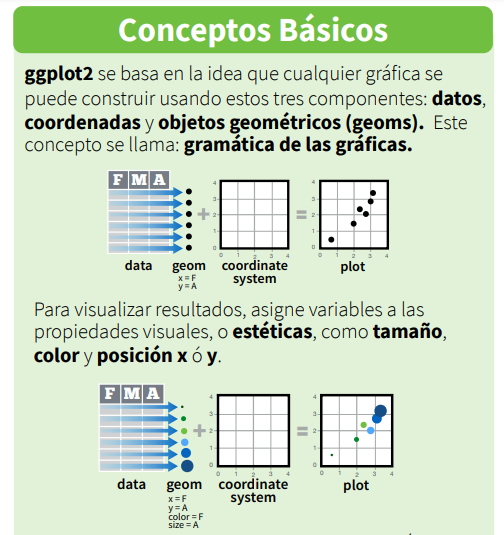
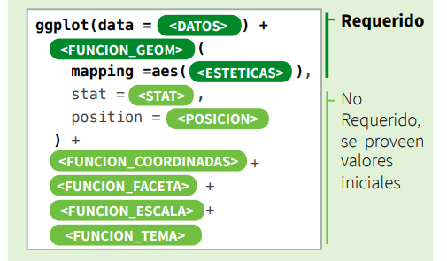

```{r setup, include=FALSE}
options(htmltools.dir.version = FALSE)
```

class: middle

<center>
<h1> Exploración de datos</h1>
</center>

<center>

</center>


> *"Conviva con sus datos antes de sumergirse en el modelamiento."* — Leo Breiman<sup>1</sup>

<br>
<br>
<br>

.foot-note[
[1][Statistical Modeling: The Two Cultures](http://users.csc.calpoly.edu/~dsun09/data401/readings/Breiman-Two-Cultures.pdf)
]

---
class: inverse, center, middle

# `ggplot2` 

<center>

</center>

### [La gramática de gráficos en capas (artículo Hadley Wickham)](http://vita.had.co.nz/papers/layered-grammar.pdf)

### [Capítulo 3 R for Data Science - Visualización de datos](https://es.r4ds.hadley.nz/visualizaci%C3%B3n-de-datos.html)

---
class: middle

# ¿Cómo funciona `ggplot2`?

.pull-left[

<center>

</center>


]

.pull-right[

<br>
<br>
<center>

</center>

]

<br>

.foot-note[
Tomado de [*hoja de referencia `ggplot2`*](https://www.rstudio.com/wp-content/uploads/2016/12/ggplot2-cheatsheet-2.1-Spanish.pdf)
]

---
class: inverse,  middle, center

# Diccionario de gráficos

### 1. Cantidades

### 2. Distribuciones

### 3. Proporciones

### 4. Relaciones *x - y*

### 5. Datos geoespaciales

### 6. Incertidumbre

.foot-note[
Fuente: [*capítulo 5 Fundamentals of Data Visualization*](https://clauswilke.com/dataviz/directory-of-visualizations.html)
]

---
class: inverse, center, middle

# `ggplot2` + `plotly`

.pull-left[

<center>

</center>

<center>

</center>

]

.pull-right[

<br>
<br>
<br>
## [`ggplotly()`](https://plotly.com/ggplot2/)


]

---
class: inverse, center, middle

# Recursos de información

.pull-left[


### [Fundamentals of Data Visualization](https://clauswilke.com/dataviz/)

<center>

</center>

]

.pull-right[

### [Data Visualization: A practical introduction](https://socviz.co/index.html)

<center>

</center>


]

---
class: inverse, center, middle

# 

<center>

</center>


