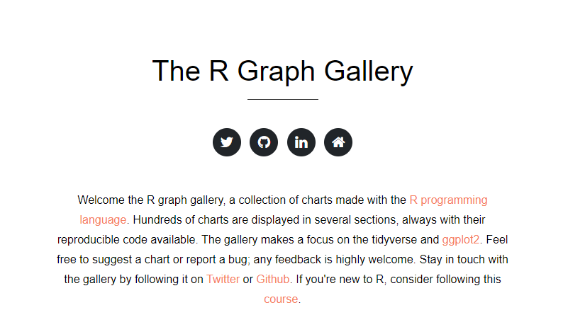

```{r setup, include=FALSE}
options(htmltools.dir.version = FALSE)
```

class: middle

<center>
<h1> Exploración de datos</h1>
</center>

<center>

</center>


> *"El mayor valor de un gráfico es cuando nos obliga a notar lo que nunca esperábamos ver."* — John Tukey


---
class: middle

# [R Graph Gallery](https://www.r-graph-gallery.com/index.html)

<center>

</center>


---
class: middle

# [Data to Viz](https://www.data-to-viz.com/)


<center>

</center>

---
class: inverse,  middle, center

# Miscelanea de gráficos

### Correlograma &#8594; [`corrplot`](https://cran.r-project.org/web/packages/corrplot/vignettes/corrplot-intro.html)

### Distribución Temporal &#8594; [`ggridges`](https://cran.r-project.org/web/packages/ggridges/vignettes/introduction.html)

### Coordenadas Paralelas &#8594; [`GGally`](https://ggobi.github.io/ggally/index.html)

### Series Temporales &#8594; [`dygraphs`](https://rstudio.github.io/dygraphs/index.html)

### Animaciones (gif) &#8594; [`gganimate`](https://gganimate.com/)

---
class: middle

# Correlograma &#8594; `corrplot`

```{r, warning=FALSE, message=FALSE, fig.width=9, fig.height=5, eval=FALSE}
library(corrplot)
library(tidyverse)
iris %>% 
  select(where(is.numeric)) %>% 
  cor(method = "pearson") %>% 
  corrplot(
    method = "pie",
    tl.srt = 25,
    tl.col = "black",
    type = "lower",
    diag = FALSE
  )
```

---
class: middle

# Correlograma &#8594; `corrplot`

```{r, warning=FALSE, message=FALSE, fig.width=9, echo=FALSE}
library(corrplot)
library(tidyverse)
iris %>% 
  select(where(is.numeric)) %>% 
  cor(method = "pearson") %>% 
  corrplot(
    method = "pie",
    tl.srt = 25,
    tl.col = "black",
    type = "lower",
    diag = FALSE
  )
```

---
class: middle

# Distribución Temporal &#8594; `ggridges`

```{r, eval=FALSE}
library(tidyverse)
library(lubridate)
library(ggridges)
library(tsibble)
AirPassengers %>% 
  as_tsibble() %>% 
  mutate(year = year(index),
         year = as_factor(year)) %>% 
  ggplot(mapping = aes(x = value, y = year)) +
  geom_density_ridges() +
  labs(x = "Pasajeros", y = "Año")
```

---
class: middle

# Distribución Temporal &#8594; `ggridges`

```{r, echo=FALSE, fig.width=9, warning=FALSE, message=FALSE, fig.align='center'}
library(tidyverse)
library(lubridate)
library(ggridges)
library(tsibble)
AirPassengers %>% 
  as_tsibble() %>% 
  mutate(year = year(index),
         year = as_factor(year)) %>% 
  ggplot(mapping = aes(x = value, y = year)) +
  geom_density_ridges() +
  labs(x = "Pasajeros", y = "Año")
```

---
class: middle

# Coordenadas Paralelas &#8594; `GGally`

.pull-left[

```{r, eval=FALSE}
library(GGally)
ggparcoord(
  iris,
  columns = 1:4,
  groupColumn = 5,
  scale = "globalminmax",
  showPoints = TRUE,
  title = "Sin escalar",
  alphaLines = 0.3
)
```

]

.pull-right[

- Argumento **`scale`**<sup>1</sup>:
  - globalminmax
  - uniminmax
  - std
  - center

]

.foot-note[
[1][Feature Scaling- Wikipedia.](https://en.wikipedia.org/wiki/Feature_scaling)
]

---
class: middle

# Coordenadas Paralelas &#8594; `GGally`


```{r, echo=FALSE, warning=FALSE, message=FALSE, fig.width=9, fig.align='center'}
library(GGally)
ggparcoord(
  iris,
  columns = 1:4,
  groupColumn = 5,
  scale = "globalminmax",
  showPoints = TRUE,
  title = "Sin escalar",
  alphaLines = 0.3
)
```

---
class: middle

# Series Temporales &#8594; `dygraphs`

- [Casos positivos de COVID-19 en Colombia](https://www.datos.gov.co/Salud-y-Protecci-n-Social/Casos-positivos-de-COVID-19-en-Colombia/gt2j-8ykr)

```{r, eval=FALSE}
# Depuración y estructuración para ejemplo
library(tidyverse)
library(lubridate)
library(janitor)

datos <- read_csv("Casos_positivos_de_COVID-19_en_Colombia.csv")

prueba <- datos %>% 
  clean_names() %>% 
  mutate(nueva_fecha = as_date(fecha_de_notificacion, format = "%d/%m/%Y"),
         sexo = str_to_upper(sexo)) %>% 
  count(nueva_fecha, sexo) %>% 
  filter(nueva_fecha != "2021-04-18")

write_rds(prueba, file = "covid_sexos.rds", compress = "xz")
```

---
class: middle

# Series Temporales &#8594; `dygraphs`

- [Descargar datos](/Actividades/2021_01/data/covid_sexos.rds)

```{r, eval=FALSE, message=FALSE, warning=FALSE}
library(xts)
library(dygraphs)
library(tidyverse)
prueba <- read_rds("data/covid_sexos.rds")

mujeres <- prueba %>% filter(sexo == "F")
hombres <- prueba %>% filter(sexo == "M") 

prueba_mujeres <- xts(x = mujeres$n, order.by = mujeres$nueva_fecha)
prueba_hombres <- xts(x = hombres$n, order.by = hombres$nueva_fecha)
ambos <- cbind(Mujeres = prueba_mujeres, Hombres =  prueba_hombres)
dygraph(ambos, width = 700, height = 350) %>% dyRangeSelector()
```

---
class: middle

# Series Temporales &#8594; `dygraphs`

```{r, echo=FALSE, message=FALSE, warning=FALSE}
library(xts)
library(dygraphs)
library(tidyverse)
prueba <- read_rds("data/covid_sexos.rds")

mujeres <- prueba %>% filter(sexo == "F")
hombres <- prueba %>% filter(sexo == "M") 

prueba_mujeres <- xts(x = mujeres$n, order.by = mujeres$nueva_fecha)
prueba_hombres <- xts(x = hombres$n, order.by = hombres$nueva_fecha)
ambos <- cbind(Mujeres = prueba_mujeres, Hombres =  prueba_hombres)
dygraph(ambos, width = 700, height = 400) %>% dyRangeSelector()
```


---
class: middle

# Animaciones (gif) &#8594; `gganimate`

```{r, eval=FALSE, message=FALSE, warning=FALSE}
library(tidyverse); library(gganimate); library(janitor); library(viridis)

ejemplo <- read_csv(
  "data/Tasas_de_homicidios_seg_n_municipios_por_cien_mil_habitantes._A_os_1990_-_2017.csv"
) %>% 
  pivot_longer(cols = -Municipio, names_to = "year",
               values_to = "homicidios",
               names_transform = list(year = as.numeric)) %>% 
  clean_names()

ejemplo %>%
  filter(municipio %in% c("Armenia", "Salento", "Montenegro")) %>% 
  ggplot(aes(x = year, y = homicidios, group = municipio, color = municipio)) +
  geom_line() +
  geom_point() +
  scale_color_viridis(discrete = TRUE) +
  labs(x = "Año", y = "Homicidios",
       title = "Homicidios departamento del Quindío") +
  transition_reveal(year)

anim_save("ejemplo.gif")
```

---
class: middle

# Animaciones (gif) &#8594; `gganimate`

```{r, eval=TRUE, message=FALSE, warning=FALSE, echo = FALSE, fig.width=9, fig.align="center"}
library(tidyverse); library(gganimate); library(janitor); library(viridis)

ejemplo <- read_csv(
  "data/Tasas_de_homicidios_seg_n_municipios_por_cien_mil_habitantes._A_os_1990_-_2017.csv"
) %>% 
  pivot_longer(cols = -Municipio, names_to = "year",
               values_to = "homicidios",
               names_transform = list(year = as.numeric)) %>% 
  clean_names()

ejemplo %>%
  filter(municipio %in% c("Armenia", "Salento", "Montenegro")) %>% 
  ggplot(aes(x = year, y = homicidios, group = municipio, color = municipio)) +
  geom_line() +
  geom_point() +
  scale_color_viridis(discrete = TRUE) +
  labs(x = "Año", y = "Homicidios",
       title = "Homicidios departamento del Quindío") +
  transition_reveal(year)
```

---
class: inverse, center, middle

# [`DataExplorer`](https://boxuancui.github.io/DataExplorer/)

<center>

</center>

### [Introduction to DataExplorer](https://cran.r-project.org/web/packages/DataExplorer/vignettes/dataexplorer-intro.html)

---
class: inverse, center, middle

# [`esquisse`](https://dreamrs.github.io/esquisse/)

<center>

</center>


---
class: inverse, center, middle

# [R Graphics Cookbook - 2nd edition](https://r-graphics.org/)

<center>

</center>

---
class: inverse, center, middle

# [`ggplot2`: elegant graphics for data analysis](https://ggplot2-book.org/)

<center>

</center>

---
class: inverse, center, middle

# [Interactive web-based data visualization with R, plotly, and shiny](https://plotly-r.com/)

<center>

</center>


---
class: inverse, center, middle

# 

<center>

</center>


