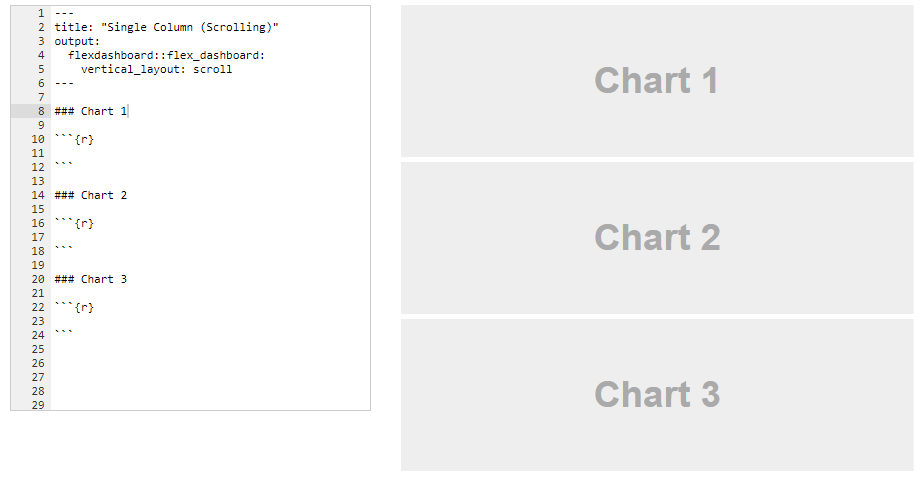
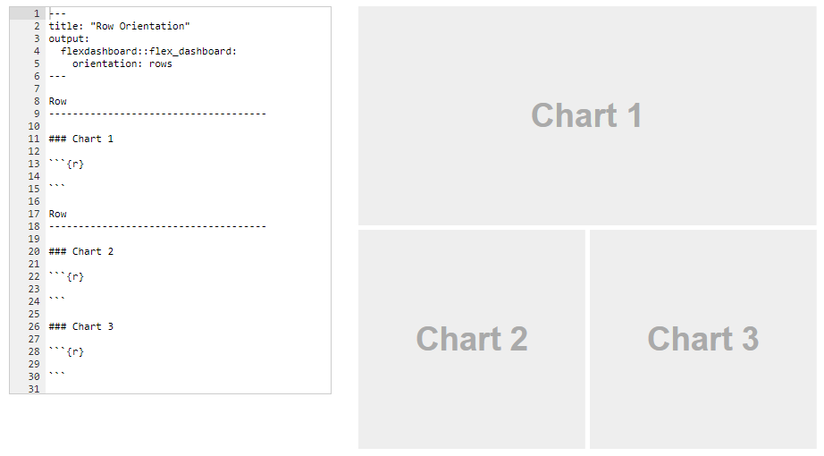
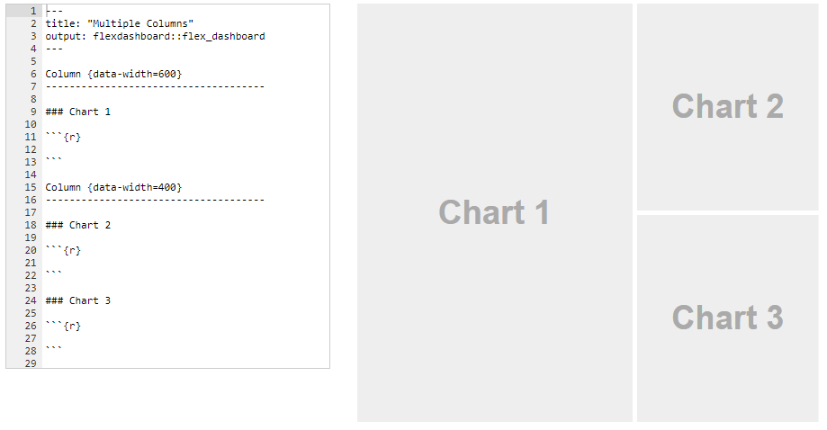
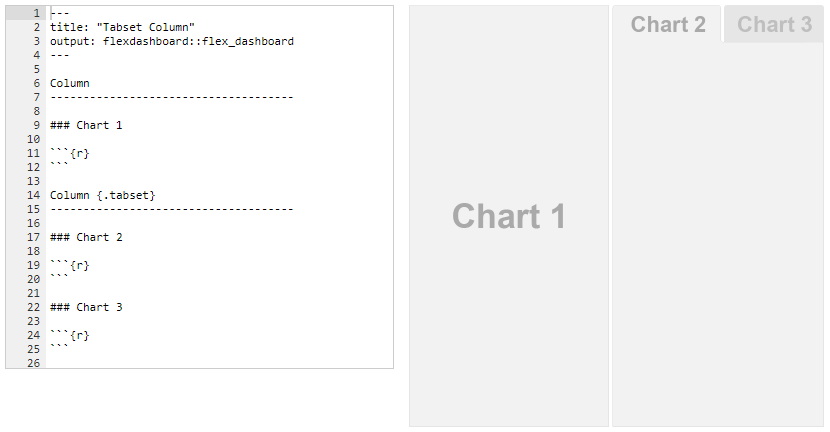
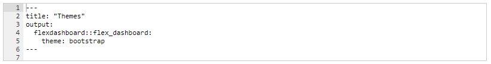
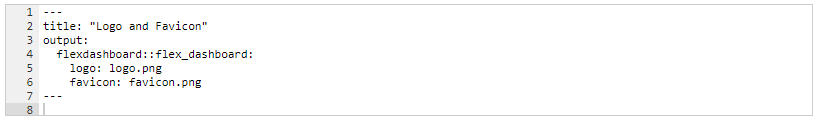

```{r setup, include=FALSE}
options(htmltools.dir.version = FALSE)
xaringanExtra::use_panelset()
```

class: inverse, center, middle

# [`flexdashboard`](https://rmarkdown.rstudio.com/flexdashboard/)

<center>

</center>

---
class: inverse, center, middle

# ¿Cómo crear Flex Dashboard?

<center>

</center>

---
class: inverse, center, middle

# Diseños

<center>

</center>

---

# Diseños básicos: una página

.panelset[

.panel[.panel-name[Fill]

<center>

</center>

]

.panel[.panel-name[Scroll]

<center>

</center>

]

.panel[.panel-name[Múltiples - Rows]

<center>

</center>

]

.panel[.panel-name[Múltiples - Columns]

<center>

</center>

]

.panel[.panel-name[Tabsets]

<center>

</center>

]

]

---

# Apariencia: temas, logo y favicon

.panelset[

.panel[.panel-name[Temas]


.pull-left[

- default
- cosmo
- bootstrap
- cerulean
- journal
- flatly
- readable
- spacelab
- united
- lumen
- paper
- sandstone
- simplex
- yeti

]

.pull-right[

<center>

</center>

]

]

.panel[.panel-name[Plantilla - Temas, Logo y Favicon]

- **Tema:**

<center>

</center>

- **Logo y Favicon:**

<center>

</center>

]

]

---
class: inverse,  middle, center

# Elementos básicos

### Paneles &#8594; Filas y Columnas

### Componentes &#8594; `###`

### `vertical_layout` &#8594; `fill` / `scroll`

### Filas/Columnas &#8594; `-------------`

###  `orientation` &#8594; `rows` / `columns`

###  Botones &#8594; `{.tabset}`

---
class: inverse,  middle, center

# Ejemplo: Raíces, Bulbos y Tubérculos Valle del Cauca


## [Descargar logo y favicon](/Actividades/2021_01/img/logo3.png)
## [resizeimage.net](https://resizeimage.net/)

---
class: inverse,  middle, center

# [R Markdown: The Definitive Guide - Chapter 5](https://bookdown.org/yihui/rmarkdown/dashboards.html)

<center>

</center>

---
class: inverse, center, middle

# 

<center>

</center>


