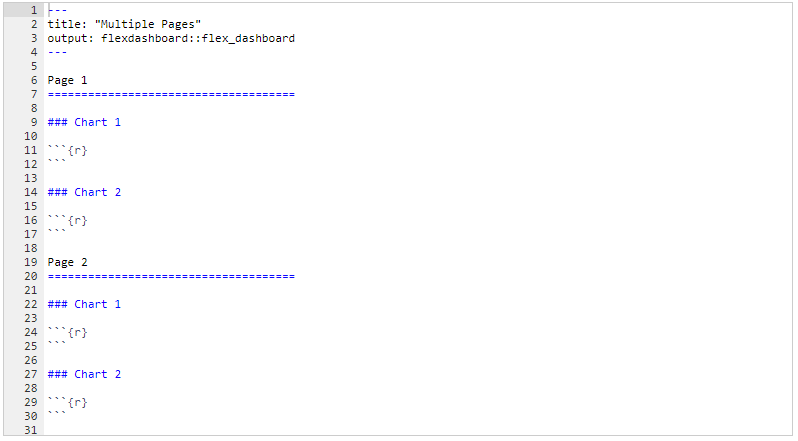
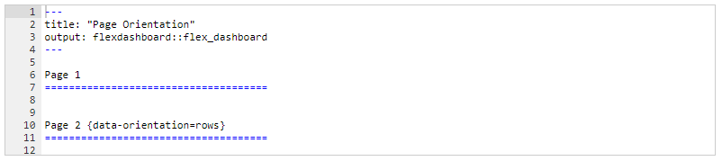
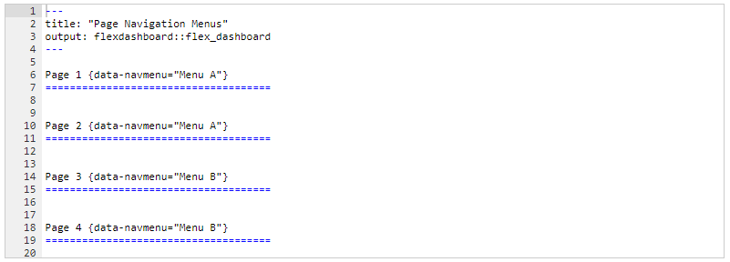
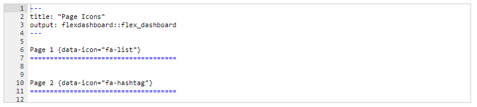
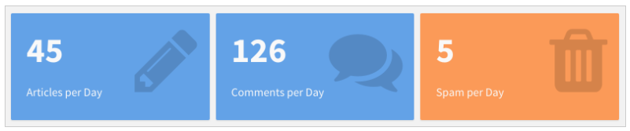
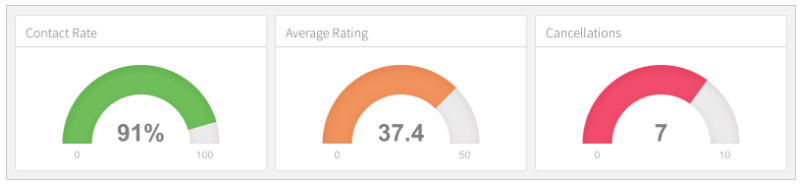
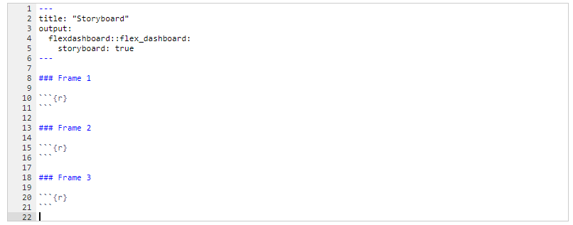
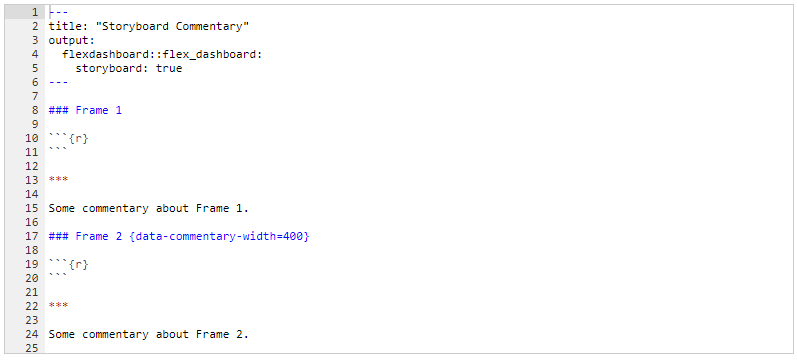
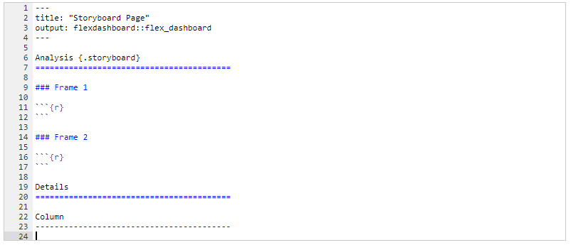

```{r setup, include=FALSE}
options(htmltools.dir.version = FALSE)
xaringanExtra::use_panelset()
```

class: inverse, center, middle

# [`flexdashboard`](https://rmarkdown.rstudio.com/flexdashboard/)

<center>

</center>

---
class: inverse, center, middle

# Diseños de múltiples páginas

<center>

</center>

---

# Más diseños...

.panelset[

.panel[.panel-name[Múltiples páginas]

<center>

</center>

]

.panel[.panel-name[Orientación]

<center>

</center>

]

.panel[.panel-name[Menú de navegación]

<center>

</center>

]

.panel[.panel-name[Íconos]

<center>

</center>

- [Consultar íconos *Font Awesome 5*.](https://www.w3schools.com/icons/default.asp)
- [Consultar íconos *Font Awesome 6*.](https://fontawesome.com/icons)

]

]


---

# Componentes adicionales

.panelset[

.panel[.panel-name[Value Boxes]

<center>

</center>

```{r, echo=TRUE, eval=FALSE}
library(flexdashboard)
valueBox(
  value = 42,
  caption = "Texto...",
  icon = "fa-thumbs-down",
  color = "#7dcf9c"
)
```

]

.panel[.panel-name[Gauges]

<center>

</center>

```{r, echo=TRUE, eval=FALSE}
library(flexdashboard)
gauge(
  value = 80, min = 0, max = 100,
  label = "Rendimiento", symbol = "%",
  gaugeSectors(
    success = c(80, 100),
    warning = c(40, 79),
    danger = c(0, 39)
  )
)
```


]

.panel[.panel-name[Colores]


- `primary`
- `info`
- `success`
- `warning`
- `danger`
- Colores compatible con *CSS*. [Consultar colores hexadecimales.](https://www.w3schools.com/colors/colors_hexadecimal.asp)

]

]

---

# Storyboard - [ejemplo](https://beta.rstudioconnect.com/jjallaire/htmlwidgets-showcase-storyboard/htmlwidgets-showcase-storyboard.html)

.panelset[

.panel[.panel-name[Estructura general]

<center>

</center>

]

.panel[.panel-name[Storyboard + Comentarios]

<center>

</center>

]

.panel[.panel-name[Múltiples páginas]

<center>

</center>

]

]

---
class: inverse,  middle, center

# [R Markdown: The Definitive Guide - Chapter 5](https://bookdown.org/yihui/rmarkdown/dashboards.html)

<center>

</center>

---
class: inverse, center, middle

# 

<center>

</center>


