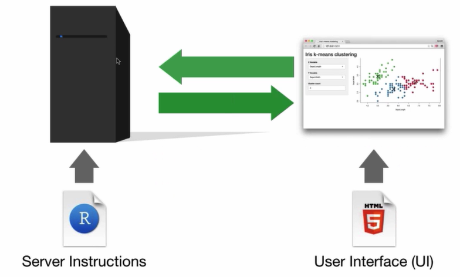
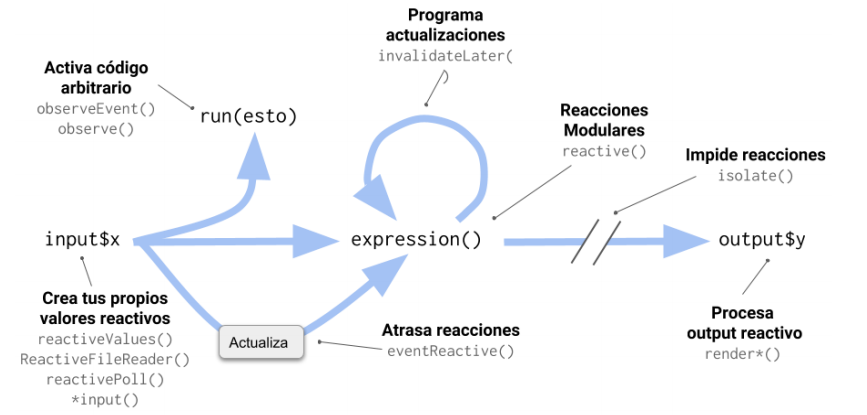
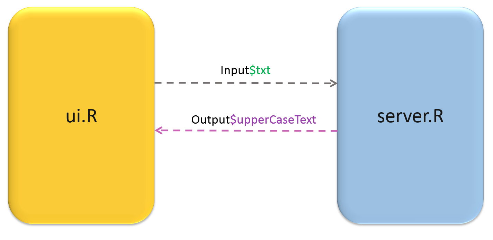
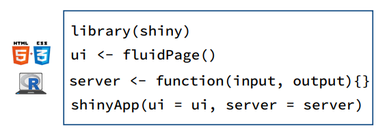
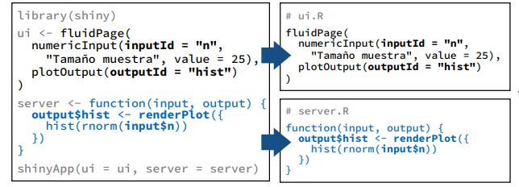
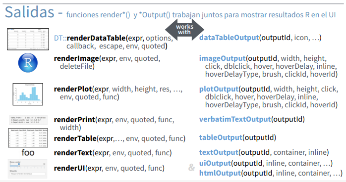
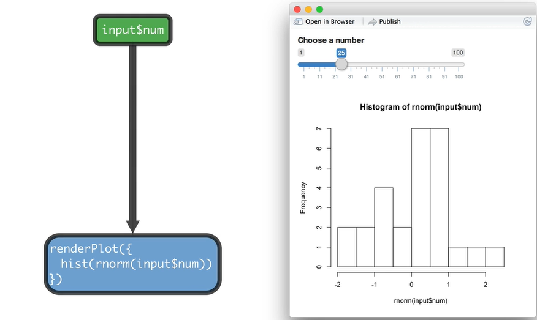

```{r setup, include=FALSE}
options(htmltools.dir.version = FALSE)
xaringanExtra::use_panelset()
```

class: inverse, center, middle

# [`shiny`](https://shiny.rstudio.com/)

<center>

</center>

[Hoja guía `shiny` (español)](shiny_Spanish.pdf)

---
class: inverse, center, middle

# ¿Qué es `shiny`?

> *"Shiny es un paquete de código abierto que proporciona un marco elegante y potente para crear aplicaciones web utilizando R. Shiny le ayuda a convertir sus análisis en aplicaciones web interactivas sin necesidad de conocimientos de HTML, CSS o JavaScript."*

> **RStudio.**

<center>

</center>

---

# ¿Cómo funciona `shiny`?

<center>

</center>

---

# ¿Qué es la reactividad?

<center>

</center>

---

# Estructura de una App con `shiny`

.panelset[

.panel[.panel-name[Componentes]


<center>

</center>

]

.panel[.panel-name[Estructura Simple]


<center>

</center>

]

.panel[.panel-name[Estructura Múltiple]


<center>

</center>

]

]

---

# Entradas &#8594; [*inputs*](https://shiny.rstudio.com/gallery/widget-gallery.html)

<center>

</center>

---

# Salidas &#8594; [*outputs*](https://shiny.rstudio.com/tutorial/written-tutorial/lesson4/)

<center>

</center>

---

# *Inputs* &#8594; *Outputs*

<center>

</center>

---
class: inverse, center, middle

# [Diseños de la App](https://www.bioinformatics.babraham.ac.uk/shiny/Intro_to_Shiny_course/examples/04.1_layouts/)

<center>

</center>

`fluidRow()`   
`flowLayout()`   
`sidebarLayout()`   
`splitLayout()`   
`verticalLayout()`   
`tabsetPanel()`    
`navlistPanel()`     
`navbarPage()`   

---
class: inverse, center, middle

# 

## [Temas con `shinythemes`](https://rstudio.github.io/shinythemes/)

## [Temas con `bslib`](https://shiny.rstudio.com/articles/themes.html)

<center>

</center>

---
class: inverse,  middle, center

# [Mastering Shiny](https://mastering-shiny.org/index.html)

<center>

</center>

---
class: inverse, center, middle

# 

<center>

</center>


