```{r setup, include=FALSE}
knitr::opts_chunk$set(echo = TRUE)
```

# 1. Instalar biblioteca `installr`

<center>
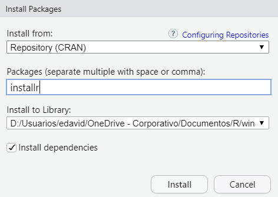
</center>

# 2. Abrir GUI de R

- **Nota:** aunque la actualización se puede realizar desde *RStudio*, se recomienda realizar dicho proceso desde la interfaz gráfica de usuario (GUI) de R.

<center>
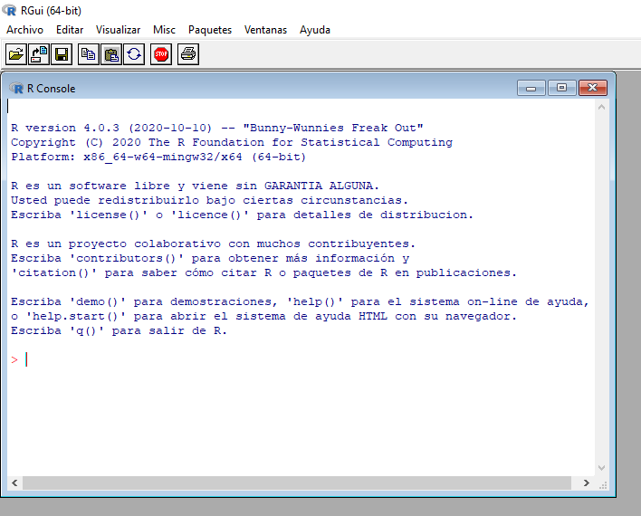
</center>

# 3. Ejecutar código `installr::updateR()`

<center>
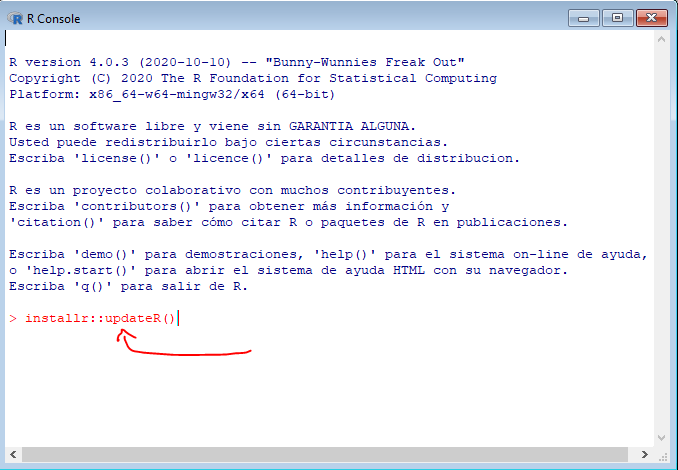
</center>

# 4. Clic en *Aceptar* 

- **Nota:** en caso de que exista alguna versión nueva obtendrá un cuadro de diálogo como el que se muestra a continuación.

<center>
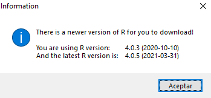
</center>

# 5. (opcional) Clic en *No* 

- **Nota:** este cuadro de diálogo le permitirá conocer las noticias o registros de actualización de la nueva versión de R.

<center>
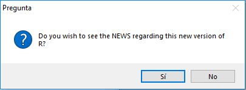
</center>

# 6. Clic en *Sí* 

- **Nota:** este cuadro de diálogo le permitirá aceptar la instalación de la nueva versión de R.

<center>
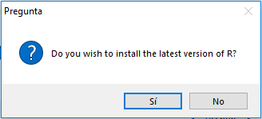
</center>

# 7. Instalación

- **Elegir idioma y clic en aceptar:**

<center>
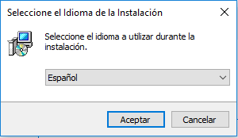
</center>

<br>

- **Clic en siguiente:**

<center>
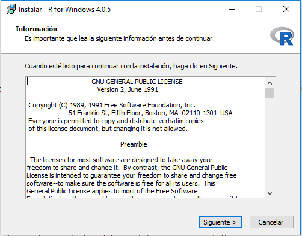
</center>

<br>

- **Elegir ruta de instalación y clic en siguiente:**

<center>
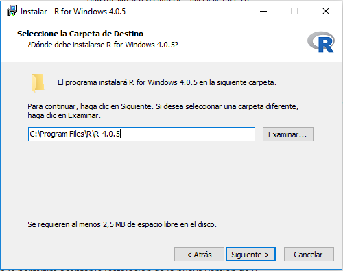
</center>

<br>

- **Mantener opciones seleccionadas y clic en siguiente:**

<center>
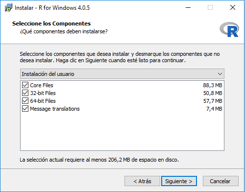
</center>

<br>

- **Mantener opciones seleccionadas y clic en siguiente:**

<center>
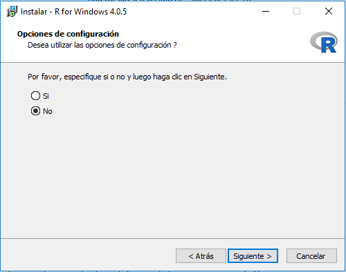
</center>

<br>

- **Mantener opciones seleccionadas y clic en siguiente:**

<center>
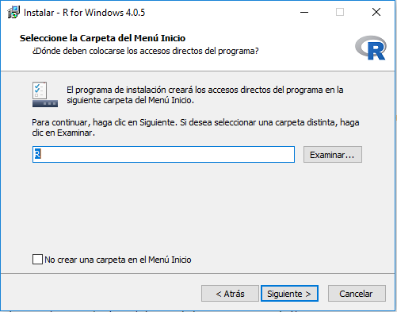
</center>

<br>

- **Mantener opciones seleccionadas y clic en siguiente:**

<center>
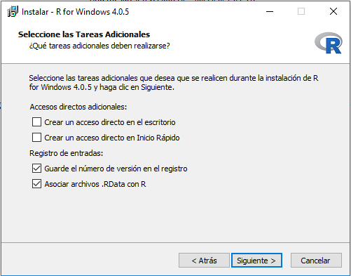
</center>

<br>

- **Esperar que el proceso de instalación termine:**

<center>
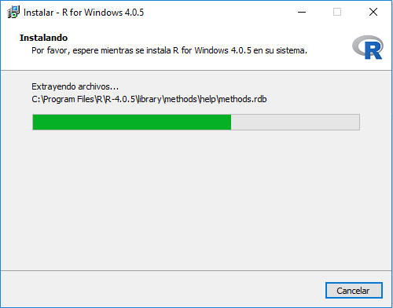
</center>

<br>

- **Dar clic en finalizar:**

<center>
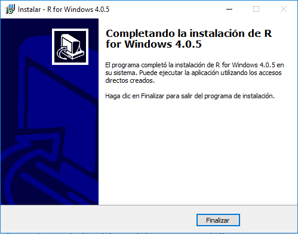
</center>

# 8. Mantener bibliotecas de versión anterior

- **Nota:** el cuadro de diálogo pregunta si desea copiar las bibliotecas que tiene instaladas en la versión anterior. Dar clic en sí.

<center>
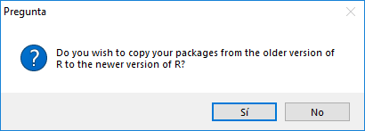
</center>

# 9. Copiar bibliotecas de versión anterior

- **Nota:** el cuadro de diálogo pregunta si desea copiar o borrar las bibliotecas que tiene instaladas en la versión anterior. Dar clic en sí, esto garantiza que las bibliotecas instaladas se mantendrán en la nueva versión.

<center>
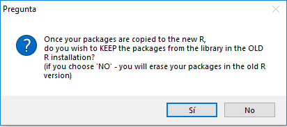
</center>

# 10. (opcional) Clic en *Sí*

- **Nota:** el archivo *Rprofile.site* conserva algunas configuraciones que usted haya asignado previamente en R.

<center>
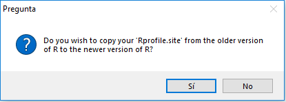
</center>

# 11. Actualizar bibliotecas

- **Nota:** dar clic en *Sí* para actualizar las bibliotecas.

<center>
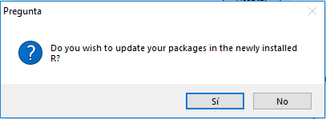
</center>