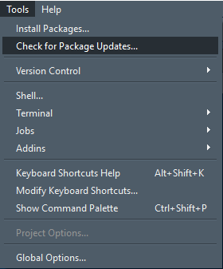
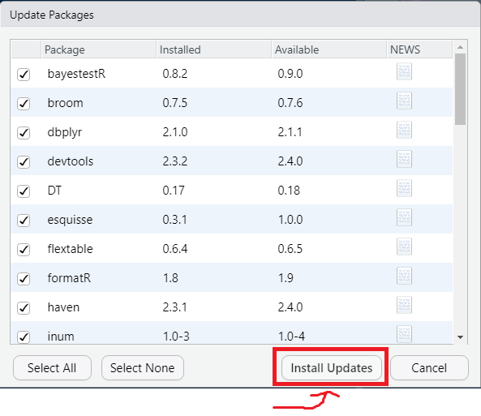
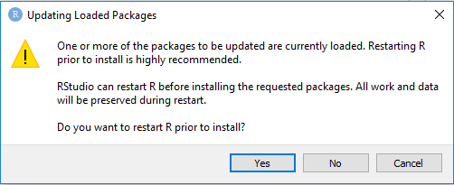
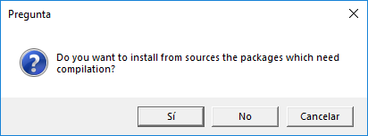
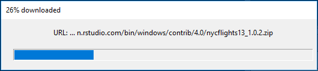
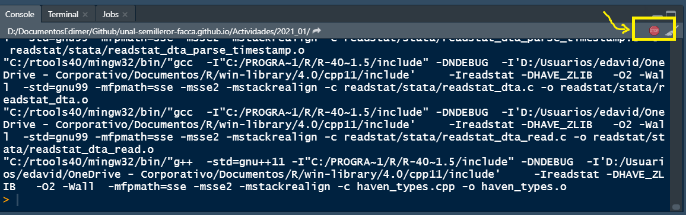

```{r setup, include=FALSE}
knitr::opts_chunk$set(echo = TRUE)
```

# 1. Clic en `tools` y luego en `Check for Pckage Updates...`

<center>

</center>

# 2. Seleccionar bibliotecas

- **Nota:** aparecerá una lista de bibliotecas para las cuales existe alguna actualización. Puede seleccionar de manera individual aquella que quiera actualizar, sin embargo, se recomienda elegir la opción `Select All` para marcar todos los paquetes.

<center>

</center>

# 3. Clic en `Install Updates`

<center>

</center>

# 4. Clic en *Yes* 

- **Nota:** el cuadro de diálogo le solicitará que reinicie el R antes de comenzar con la actualización

<center>

</center>

# 5. Clic en *Sí*

- **Nota:** dependiendo de las bibliotecas que haya instalado previamente obtendrá este cuadro de diálogo. Si no aparece no hay ningún problema.

<center>

</center>

# 6. Esperar actualización...

- **Nota:** en su pantalla identificará cuadros de carga como el que se muestra a continuación.

<center>

</center>

# 7. Finalización de actualización

- **Nota:** el proceso finalizará cuando el botón rojo de *Stop* no aparezca encendido en su consola, de lo contrario debe esperar.

<center>

</center>

