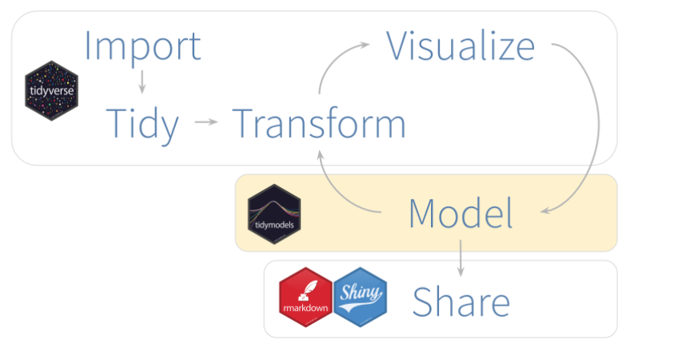
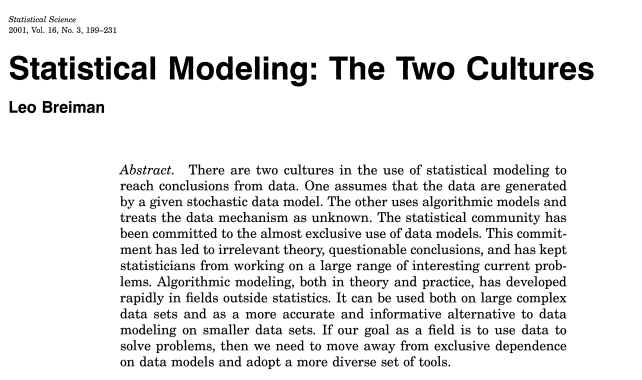
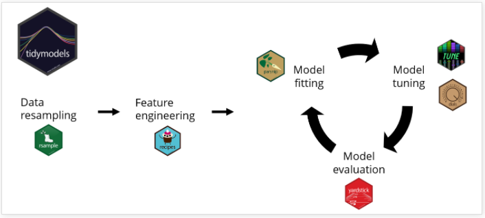

```{r setup, include=FALSE}
options(htmltools.dir.version = FALSE)
```

background-image: url(https://www.grid.cl/blog/wp-content/uploads/2019/03/Machine-learning-1024x682.jpg)
background-position: 50% 50%
class: center, bottom, inverse

---
class: center, middle


<center>

</center>

.footnote[
[Fuente: Diego Kozlowski y Juan Manuel Barriola](https://diegokoz.github.io/EEA2019/clase%208/tidymodels.nb.html)
]

---

# Antecedentes históricos

<center>

</center>

---

# IA, ML y DL

<center>

</center>

---

# ¿Qué es Machine Learning?

.pull-left[

<center>

</center>

<br>
<center>

</center>


]

.pull-right[

<center>

</center>

<br>

<center>

</center>

]

---

# Tipos de aprendizaje

<center>

</center>

---

# Moodelamiento Estadístico

> *"Si nuestro objetivo como campo es usar datos para resolver problemas, entonces debemos alejarnos de la dependencia exclusiva de los modelos de datos y adoptar un conjunto de herramientas más diverso"*.
> Leo Breiman.

<center>

</center>

.footnote[
[Statistical Modeling: The Two Cultures](http://www2.math.uu.se/~thulin/mm/breiman.pdf)
]

---

# Proceso de *Ciencia de Datos* y esquema de modelación

<center>

</center>

<center>

</center>


---

# [*Tidy Modeling with R*](https://www.tmwr.org/)

<center>

</center>

---

#  

.pull-left[

### [`tidyverse`](https://www.tidyverse.org/)

<center>

</center>

]

.pull-right[

### [`tidymodels`](https://www.tidymodels.org/)

<center>

</center>

]

---

<center>

</center>

---

# Construcción de modelos predictivos

  0. Entendimiento del problema
  1. Análisis exploratorio  
  2. Remuestreo de datos
  3. Preprocesamiento
  4. Ingeniería de características
  5. Optimización de hiperparámetros
  6. Evaluación del modelo

<center>

</center>

.footnote[
[Fuente: Tidymodels Ecosystem Tutorial](https://rpubs.com/chenx/tidymodels_tutorial)
]

---

# Aprendizaje supervisado con R


| Algoritmo | Función | Biblioteca | Tipo |
| :------- | :--------: | :-----: | :--: |
| Regresión lineal | `lm()`  | `stats`  | Regresión |
| Regresión logística | `glm()` | `stats` | Clasificación |
| Regresión regularizada | `glmnet()` | `glmnet` | Regresión, Clasificación |
| K-vecinos más cercanos | `kknn()`  | `kknn`  | Regresión, Clasificación |
| Árboles de decisión | `rpart()`  | `rpart`  | Regresión, Clasificación |
|  Análisis discriminante lineal | `lda()`  | `MASS`  | Clasificación |
| Análisis discriminante flexible | `earth()`  | `earth`  | Regresión |
| Splines de regresión adaptativa multivariante (MARS)| `earth()`  | `earth`   | Regresión |


---

# Aprendizaje supervisado con R


| Algoritmo | Función | Biblioteca | Tipo |
| :------- | :--------: | :-----: | :--: |
| Random Forest | `ranger()`  | `ranger`  | Regresión, Clasificación |
| Naive Bayes | `naive_bayes()`  | `naivebayes`  | Clasificación |
| Support Vector Machine | `svm()`  | `liquidSVM `  | Regresión, Clasificación |
| Extreme Gradient Boosting | `xgboost()`  | `xgboost` | Regresión, Clasificación |
| Perceptrón multicapa | `nnet()`  | `nnet`  | Regresión, Clasificación |
| Regresión multinomial  | `multinom()`  | `nnet`  | Regresión, Clasificación |
| Light Gradient Boosting Machine | `lightgbm()`  | `lightgbm`  | Regresión, Clasificación |

---

# Ejemplo de regresión: [Predicción de gastos por turistas en Tanzania](https://zindi.africa/competitions/tanzania-tourism-prediction/data)

<center>

</center>

## [Descargar datos](/Actividades/2022_01/data/01-regresion-tanzania.zip)

---
class: inverse, center, middle

# [*Tidy Modeling with R*](https://www.tmwr.org/)

<center>

</center>

---
class: inverse, center, middle

# [*Hands-On Machine Learning with R*](https://bradleyboehmke.github.io/HOML/)

<center>

</center>

---
class: inverse, center, middle

# [*Explanatory Model Analysis - Explore, Explain, and Examine Predictive Models*](https://ema.drwhy.ai/)

<center>

</center>

---
class: inverse, center, middle

# [*Feature Engineering and Selection: A Practical Approach for Predictive Models*](http://www.feat.engineering/)

<center>

</center>


---
class: inverse, center, middle


<center>

</center>


