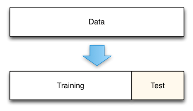
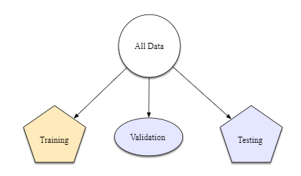
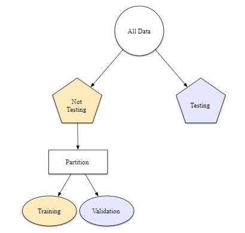
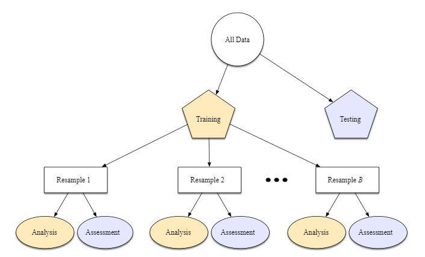
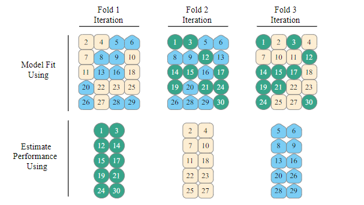
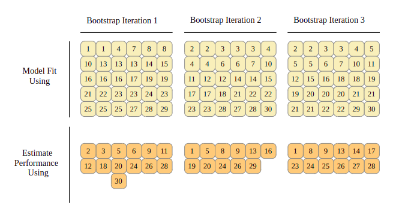

class: inverse, center, middle

```{r setup, include=FALSE}
options(htmltools.dir.version = FALSE)
knitr::opts_chunk$set(echo = TRUE)
library(xaringanExtra)
xaringanExtra::use_panelset()
```

# Remuestreo

<center>

</center>


---

# Remuestreo con `rsample`

.panelset.sideways[

.panel[.panel-name[Train - Test] 

<center>

</center>

]

.panel[.panel-name[Train, Validation y Test] 

<center>

</center>

]

.panel[.panel-name[Train, Validation y Test] 

<center>

</center>

]

.panel[.panel-name[Validación Cruzada] 

<center>

</center>

]

.panel[.panel-name[Validación Cruzada (*k-folds*)] 

<center>

</center>

]

.panel[.panel-name[Bootstrapping] 

<center>

</center>

]


]


.footnote[
[Fuente: Tidy Modeling with R](https://www.tmwr.org/)
]

---

# Modelos con `parsnip`


<center>

</center>

- [Modelos disponibles con `parsnip`](https://www.tidymodels.org/find/parsnip/)

---
class: inverse, center, middle

# [*Tidy Modeling with R*](https://www.tmwr.org/)

<center>

</center>


---
class: inverse, center, middle


<center>

</center>


