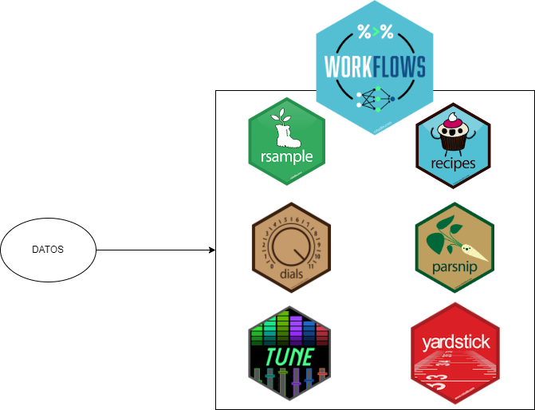

class: inverse center, middle

```{r setup, include=FALSE}
options(htmltools.dir.version = FALSE)
knitr::opts_chunk$set(echo = TRUE)
library(xaringanExtra)
xaringanExtra::use_panelset()
```

# Flujo de Machine Learning

<center>

</center>

---

# `workflows` con *Tidymodels*

<center>

</center>


---
class: inverse, center, middle

# [*Tidy Modeling with R*](https://www.tmwr.org/)

<center>

</center>


---
class: inverse, center, middle


<center>

</center>


