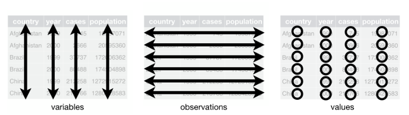
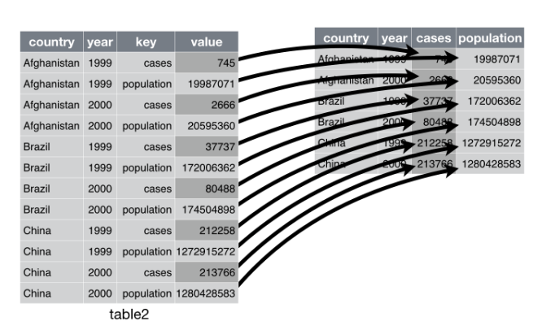

```{r setup, include=FALSE}
knitr::opts_chunk$set(echo = TRUE,
                      warning = FALSE,
                      message = FALSE,
                      error = FALSE,
                      fig.align = "center",
                      fig.width = 7.5,
                      fig.height = 5.5)
```

# Semillero de R - FacCA {data-background="fondo1.png"}

# Mundo R + `tidyverse` II {data-background="fondo_tidy.png"}

# Estadística Descriptiva con R {data-background="lengR.png"}

## {data-background="lengR.png"}

<center>
| Función | Descripción |
| :--- | :----------------: |
| `mean()` | Media |
| `median()` | Mediana |
| `sd()` | Desviación estándar |
| `var()` | Varianza |
| `range()` | Rango |
| `min()` | Valor mínimo |
| `max()` | Valor máximo |
| `quantile()` | Cuartiles, deciles y percentiles |
| `cor()` | Coeficiente de correlación |
| `IQR()` | Rango intercuartílico |
| `skewness()` | Coeficiente de asimetría (biblioteca **moments**) |
| `kurtosis()` | Coeficiente de curtosis (biblioteca **moments**) |
</center>

## {data-background="lengR.png"}

<center>
| Función | Descripción |
| :--- | :----------------: |
| `table()` | Tabla de frecuencias absolutas |
| `prop.table()` | Tabla de frecuencias relativas |
| `sort()` | Ordenar los datos |
| `sum()()` | Sumar |
| `colSums()` | Suma por columnas |
| `rowSums()` | Suma por filas |
| `colMeans()` | Promedios por columnas |
| `rowMeans()` | Promedios por filas |
</center>

# Datos ordenados (`tidy data`) {data-background="fondo_tidy.png"}

## {data-background="fondo_tidy.png"}

>“Tidy datasets are all alike but every messy dataset is messy in its own way.”
>
> – Hadley Wickham

## ¿Qué son datos ordenados? {data-background="fondo_tidy.png"}

  1. Cada **variable** debe tener su propia columna.
  2. Cada **observacioón** debe tener su propia fila.
  3. Cada **valor** debe tener su propia celda.
  
```{r, echo=FALSE, out.width="715px", out.height="220px"}

``` 

## ¿Qué son datos ordenados? {data-background="fondo_tidy.png"}
<br>
<br>
```{r, echo=FALSE, out.width="615px", out.height="270px"}
knitr::include_graphics("tidy4.png")
```

## Funciones `tidyr` {data-background="fondo_tidy.png"}

  - **`spread()`:** de formato largo a formato ancho.
  - **`gather()`:** de formato ancho a formato largo.
  - **`separate()`:** separar columnas.
  - **`unite()`:** unir columnas.

## Usos de las funciones `tidyr` {data-background="fondo_tidy.png"}

- `spread(data, key, value)`
- `gather(data, "variable1", "variable2", 1:3)`
- `separate(data, Separ, into = c("n1", "n2"), sep = "/")`
- `unite(data, "nueva", var1, var2, sep = "")`

## `spread()` {data-background="fondo_tidy.png"}
<br>
<br>
```{r, echo=FALSE, out.width="615px", out.height="410px"}

```  
  
## `gather()` {data-background="fondo_tidy.png"}
<br>
<br>
```{r, echo=FALSE, out.width="515px", out.height="220px"}
knitr::include_graphics("tidy3.png")
```

# Ejemplos {data-background="fondo_tidy.png"}

## Resultados Saber 11º {data-background="fondo_tidy.png"}

- Ejemplo grupo lunes: [ICFES 2017-02.](https://www.datos.gov.co/Educaci-n/Saber-11-2017-2/s6qh-49yh)

- Ejemplo grupo martes: [ICFES 2018-02.](https://www.datos.gov.co/Educaci-n/Saber-11-2018-2/m2nt-jw2h)