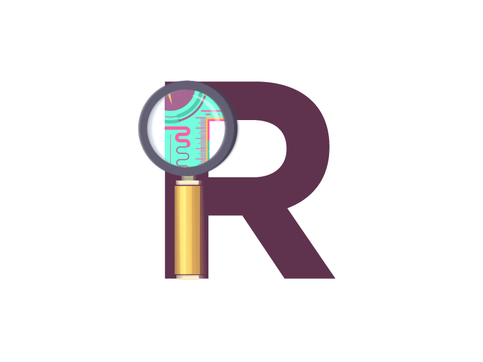

<center> <h2> ¡Bienvenidos al Semillero de Ciencia de Datos! </h2> </center>

<style>
.button {
  background-color: #2c3e50;
  border: none;
  color: white;
  padding: 15px 32px;
  text-align: center;
  text-decoration: none;
  display: inline-block;
  font-size: 16px;
  margin: 4px 2px;
  cursor: pointer;
}
</style>

<center>
<a href="https://forms.gle/SnGgTKn5sYq8iSZn6" class="button">Inscripciones aquí!😁</a>
</center>

```{r, echo=FALSE, fig.align="center", out.width="580", out.height="425"}

```

