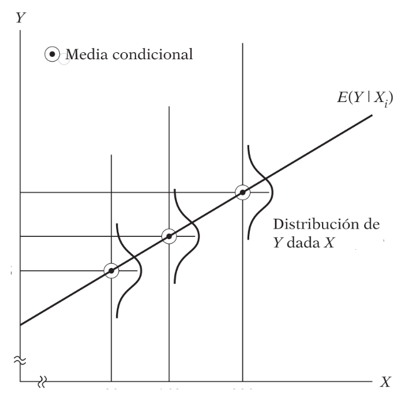

```{r setup, include=FALSE}
knitr::opts_chunk$set(echo = FALSE,
                      message = FALSE,
                      warning = FALSE,
                      fig.align = "center")
```

# Problema

## Descripción del problema
<div class = "black">
**Gasto militar vs Gasto en Educación:** previamente se evidenció a través de gráficos de dispersión y métricas de correlación, la relación negativa entre la inversión militar y la inversión en educación. Se sugiere construir un modelo de regresión lineal simple que permita determinar el cambio en $y$ dado $x$, es decir, que el modelo permitirá establecer por cada unidad que aumenta el gasto militar, cuánto disminuye el gasto en educación.
El modelo se puede expresar de la siguiente manera: 
<br>
<br>
<center>
- Modelo matemático: $y = mx + b$
- Modelo estadístico 1: $y = \beta_0\ +\ \beta_1X$
- Modelo estadístico 2: $\hat{y_i} = \hat{\beta_0}\ + \hat{\beta_1}X_i\ + \epsilon_i$
</center>
</div>
# Gasto Militar vs Gasto Educación

## Base de datos
<br>
<br>
```{r}
# Lectura de datos
datos <- read.csv("Datos/Datos_Continentes.csv",
                  encoding = "UTF-8")
# Omitiendo NAs
library(dplyr)
df_reg <- datos %>% 
  filter(!is.na(gasto_militar17)) %>% 
  filter(!is.na(gasto_edu16)) %>% 
  select(pais, gasto_militar17, gasto_edu16) %>% 
  filter(gasto_militar17 <= 10)
df_reg
```

## Distribuciones

<div class="columns-2">
#### Gasto militar
```{r, fig.width=5}
hist(df_reg$gasto_militar17,
     xlab = "Gasto militar (% del PIB)",
     ylab = "Frecuencia",
     col = "forestgreen",
     main = "Distribución del G. Militar")
abline(v = mean(df_reg$gasto_militar17), col = "red",
       lwd = 2)
```
<div class="columns-2">
#### Gasto Educación
```{r, fig.width=5}
hist(df_reg$gasto_edu16,
     xlab = "Gasto en educación (% del PIB)",
     ylab = "Frecuencia",
     col = "forestgreen",
     main = "Distribución del G. en Educación")
abline(v = mean(df_reg$gasto_edu16), col = "red",
       lwd = 2)
```
</div>

## Gráficos de dispersión
<div class="columns-2">
#### Con valor atípico
```{r, fig.width=5}
plot(x = datos$gasto_militar17,
     y = datos$gasto_edu16,
     xlab = "Gasto Miliar",
     ylab = "Gasto en Educación",
     main = "Relación del G. Militar vs G. Educación\n% del PIB",
     pch = 19)
abline(lm(datos$gasto_edu16 ~ datos$gasto_militar17),
       col = "red", lwd = 2)
```
<div class="columns-2">
#### Sin valor atípico
```{r, fig.width=5}
plot(x = df_reg$gasto_militar17,
     y = df_reg$gasto_edu16,
     xlab = "Gasto Miliar",
     ylab = "Gasto en Educación",
     main = "Relación del G. Militar vs G. Educación\n% del PIB",
     pch = 19)
abline(lm(df_reg$gasto_edu16 ~ df_reg$gasto_militar17),
       col = "red", lwd = 2)
```
</div>

# Correlación

## Concepto
<div class = "black">
El coeficiente de correlación de *Pearson* es una medida lineal entre dos variables aleatorias cuantitativas. A diferencia de la covarianza, la correlación es independiente de la escala de medida.

Este coeficiente puede ser de dos tipos:

- Paramétrico: sujeto a distribución normal o gausiana.
- No paramétrico: no está sujeto a distribución normal o gausiana.
<br>
<br>
$$\rho_{(X,Y)} = \frac{Cov_{(X,Y)}}{\sigma_X\times\sigma_Y} = \frac{\sum_{i=1}^{n}(X_i-\mu_X)(Y_i-\mu_Y)}{\sigma_X\times\sigma_Y}$$
</div>
## Interpretación de $\rho$

```{r, out.width="650px"}
knitr::include_graphics("images/corr.jpg")
```

```{r, out.width="650px"}

```

## Relaciones Lineales: análisis exploratorio

```{r, out.width="650px", fig.cap="[Fuente: Wikipedia.](https://en.wikipedia.org/wiki/Anscombe%27s_quartet)"}
knitr::include_graphics("images/cor_ascombe.png")
```

## Prueba de Hipótesis para $\rho$
<div class = "columns-2">
<div class = "black">- **Correlación de Pearson con dato atípico:**</div>

```{r, echo=FALSE}
cor(datos$gasto_edu16, datos$gasto_militar17,
    use = "pairwise.complete.obs")
```

```{r, fig.width=5}
plot(x = datos$gasto_militar17,
     y = datos$gasto_edu16,
     xlab = "Gasto Miliar",
     ylab = "Gasto en Educación",
     main = "Relación del G. Militar vs G. Educación\n% del PIB",
     pch = 19)
abline(lm(datos$gasto_edu16 ~ datos$gasto_militar17),
       col = "red", lwd = 2)
```

#### Test de hipótesis con valor atípico
<div class = "black">
$$H_0: \rho = 0\\H_1: \rho \neq 0$$
</div>
```{r}
cor.test(datos$gasto_militar17, datos$gasto_edu16)
```
<div class = "black">
**Conclusión:** como el valor p (0.9656) es mayor que el nivel de significancia $\alpha = 0.05$, no existe evidencia para rechazar la hipótesis nula.</div>
</div>
## Prueba de Hipótesis para $\rho$
<div class = "columns-2">
<div class = "black">- **Correlación de Pearson sin dato atípico:**</div>

```{r}
cor(df_reg$gasto_edu16, df_reg$gasto_militar17,
    use = "pairwise.complete.obs")
```

```{r, fig.width=5}
plot(x = df_reg$gasto_militar17,
     y = df_reg$gasto_edu16,
     xlab = "Gasto Miliar",
     ylab = "Gasto en Educación",
     main = "Relación del G. Militar vs G. Educación\n% del PIB",
     pch = 19)
abline(lm(df_reg$gasto_edu16 ~ df_reg$gasto_militar17),
       col = "red", lwd = 2)
```

#### Test de hipótesis sin valor atípico
<div class = "black">
$$H_0: \rho = 0\\H_1: \rho \neq 0$$

```{r}
cor.test(df_reg$gasto_militar17, df_reg$gasto_edu16)
```

**Conclusión:** como el valor p (0.1199) es mayor que el nivel de significancia $\alpha = 0.05$, no existe evidencia para rechazar la hipótesis nula.</div>
</div>

# Regresión Lineal Simple (RLS)

## Origen: Francis Galton

<div class = "columns-2">
```{r, out.width="380px", fig.cap="[Revista Biometrika](https://academic.oup.com/biomet)"}
knitr::include_graphics("images/galton.jpg")
```
<br>
<br>
```{r, out.width="550px"}
knitr::include_graphics("images/galtondatos.PNG")
```
</div>

## Idea intuitiva RLS

```{r, out.width="550px"}
knitr::include_graphics("images/regression.gif")
```

### Modelo tentativo
<div class = "black">
El modelo tentativo se puede expresar de la siguiente manera:

$$G.Edu = \beta_0\ +\ \beta_1G.Militar$$
</div>
## RLS: percepción geométrica
<div class = "columns-2">
```{r, out.width="550px"}

```
<br>
<br>
<br>
<br>
<br>
```{r, out.width="600px"}
knitr::include_graphics("images/regression3.gif")
```
</div>

## RLS: ajuste de parámetros

<div class = "columns-2">
<br>
```{r, out.width="550px"}
knitr::include_graphics("images/regression5.gif")
```

```{r, out.width="550px"}
knitr::include_graphics("images/regression2.gif")
```
</div>
<div class = "black">
$$f(x|\mu,\sigma^2) = \frac{1}{\sqrt{2\pi\sigma^2}}e^{-\frac{(x-\mu)^2}{2\sigma^2}}$$
</div>
## RLS: función muestral
<div class = "columns-2">
<br>
<br>
```{r, out.width="500px", out.height="380px"}
knitr::include_graphics("images/regmuestral.PNG")
```
<br>
<br>
<br>
```{r, out.width="500px", out.height="270px"}
knitr::include_graphics("images/regression4.gif")
```
</div>

## Función matemática
<div class = "black">
$$Y_i = E(Y|X_i)\ +\ \epsilon_i\\$$

Asumiendo que $E(Y|X_i)$ es lineal en $X_i$:

$$Y_i = E(Y|X_i)\ +\ \epsilon_i\\
Y_i = \beta_0 +\ \beta_1X_i\ +\ \epsilon_i$$

Tomando el valor esperado (esperanza matemática) a ambos lados:

$$E(Y_i|X_i)\ =\  E[E(Y|X_i)] + E(\epsilon_i|X_i)\\
E(Y_i|X_i)\ =\ E(Y|X_i)\ +\ E(\epsilon_i|X_i)$$

Como $E(Y_i|X_i)$ es igual a $E(Y|X_i)$, la ecuación anterior determina que $E(\epsilon_i|X_i) = 0$. Este supuesto implica que la media condicional de $\epsilon_i$ es cero.
</div>

## Parámetros $\beta_0$ y $\beta_1$

```{r, fig.width=8.5, fig.height=5.5}
# Ventana de graficación
par(mfrow = c(1, 2))

# Gráfico 1
x <- c(0, 4)
y <- c(0, 4)
plot(x, y, type ="n", xlab = "X = Predictor", ylab = "E(Y|X=x)")      
abline(0.8, 0.7)      
x<-c(2, 3, 3)      
y<-c(2.2, 2.2, 2.9)      
lines(x, y, lty = 2)      
lines(c(0, 0), c(0, 0.8), lty = 2)      
#lines(c(0, 4), c(0, 0), lty=2)      
text(3.05, 2.5, expression(beta[1] == Pendiente), adj = 0)      
text(0.05, 0.4, expression(beta[0] == Intercepto), adj = 0)      
text(2.5, 1.8, "1")

# Gráfico 2
x <- c(0, 4) 
y <- c(0, 4) 
plot(x, y, type = "n", xlab = "X = Predictor", ylab = "E(Y|X=x)")    
abline(0.8, 0.7, lty = 2)
x <- seq(0, 4, length = 200) 
y <- 0.175*x*x + 1.10625 
lines(x, y)
lines( c(3.8, 3.8), c(3.46, 3.63325))
text(1, 2.7, "Función media lineal", adj = 0, cex = 0.8)
text(1.5, 1.2, "Verdadera función media", adj = 0, cex = 0.8)
text(3.5, 3.5, "Error por falta de ajuste", adj=1, cex = 0.8)
library(diagram)
curvedarrow(from = c(3, 3.6), to = c(3.7, 3.7), lwd = 0.5, lty = 1, curve = -0.5)
```

## [Mínimos Cuadrados](https://es.wikipedia.org/wiki/M%C3%ADnimos_cuadrados)

<div class = "black">
**El propósito principal del análisis de regresión es estimar la función de regresión poblacional con base en la función de regresión muestral:**

$$Y_i = \beta_0\ +\ \beta_1X$$
$$\hat{Y_i} = \hat{\beta_0}\ + \hat{\beta_1}X_i\ + \hat{\epsilon_i}$$
</div>

<center>
[{width=67%}](https://www.youtube.com/watch?v=k964_uNn3l0)
</img>

## Supuestos matemáticos
<div class = "black">
1. Linealidad en los parámetros.
2. Valores de $X$ independientes del término residual $\epsilon$.
3. <rojo>Valor medio de los residuales igual a cero: $E(\epsilon_i|X_i) = 0$.</rojo>
4. <rojo>Homocedasticidad o varianza constante de los errores $\epsilon_i$.</rojo>
5. Independencia de los errores (autocorrelación): $cov(\epsilon_i, \epsilon_j)=0$.
<br>
<br>
$$\epsilon\ \overset{\text{i.i.d.}}\sim\ N(\mu = 0,\ \sigma^2 = 1)$$

</div>

## Normalidad de los residuos
<div class = "black">
$$E(\epsilon_i|X_i)=0$$
</div>

```{r, out.width="580px"}

```

## Homocedasticidad
<div class = "black">
$$Var(\epsilon_i) = E[\epsilon_i-E(\epsilon_i|X_i)]^2\\
= E(\epsilon_i^2|X_i) \\
= E(\epsilon_i^2)\\
= \sigma^2$$
</div>

```{r, out.width="570px"}
knitr::include_graphics("images/homocedasticidad.PNG")
```

## ¿Heterocedasticidad?
<br>
<br>
```{r, out.width="630px"}
knitr::include_graphics("images/heterocedasticidad.PNG")
```

# Regresión Lineal con R

## Función `lm()` - `summary()`

```{r, out.width="550px", echo=TRUE}
#<b>
mod1 <- lm(gasto_edu16 ~ gasto_militar17, data = df_reg)
#</b>
resumen_modelo <- summary(mod1)
resumen_modelo
```

## Graficando recta (estático)
<div class = "columns-2">
```{r, fig.width=4.5}
plot(x = df_reg$gasto_militar17, y = df_reg$gasto_edu16, pch = 19,
     xlab = "G. Militar (% del PIB)", ylab = "G. Educación (% del PIB)",
     main = "Modelo ajustado\ngraphics")
abline(lm(df_reg$gasto_edu16 ~ df_reg$gasto_militar17), lwd = 2,
       col = "forestgreen")
grid()
```


```{r, fig.width=4}
library(ggplot2)
df_reg %>% 
  ggplot(data = ., aes(x = gasto_militar17, y = gasto_edu16)) + 
  geom_point() +
  theme_light() +
  geom_smooth(method = "lm", se = FALSE,  color = "forestgreen", lwd = 1.2) +
  labs(x = "G. Militar (% del PIB)",
       y = "G. Educación (% del PIB)",
       subtitle = "Modelo ajustado\nggplot2")
```
</div>

## Graficando recta (ggplotly)
<div class = "rows-2">
```{r, eval=FALSE, echo=TRUE}
library(plotly)
ggplotly(df_reg %>% 
  ggplot(data = ., aes(x = gasto_militar17, y = gasto_edu16)) + 
  geom_point() + theme_light() +
  geom_smooth(method = "lm", se = FALSE,  color = "forestgreen", lwd = 1.2) +
  labs(x = "G. Militar (% del PIB)",
       y = "G. Educación (% del PIB)",
       title = "Modelo ajustado\nggplot2"))
```
<center>
```{r, fig.width=6.3, fig.height=3.5}
library(plotly)
ggplotly(df_reg %>% 
  ggplot(data = ., aes(x = gasto_militar17, y = gasto_edu16)) + 
  geom_point() +
  theme_light() +
  geom_smooth(method = "lm", se = FALSE,  color = "forestgreen", lwd = 1.2) +
  labs(x = "G. Militar (% del PIB)",
       y = "G. Educación (% del PIB)",
       title = "Modelo ajustado\nggplot2"))
```
</center>
</div>

## Graficando recta (plot_ly)
<div class = "rows-2">
```{r, eval=FALSE, echo=TRUE}
library(plotly)
df_reg %>% 
  plot_ly(x = ~gasto_militar17) %>% 
  add_markers(y = ~gasto_edu16) %>% 
  layout(title = "Modelo ajustado\nplotly",
         width = 600, height = 300,
         xaxis = list(title = "G. Militar (% del PIB)"),
         yaxis = list(title = "G. Educación (% del PIB)")) %>% 
  add_lines(x = ~gasto_militar17, y = fitted(mod1)) %>% 
  layout(showlegend = FALSE)
```
<center>
```{r}
library(plotly)
df_reg %>% 
  plot_ly(x = ~gasto_militar17) %>% 
  add_markers(y = ~gasto_edu16) %>% 
  layout(title = "Modelo ajustado\nplotly",
         width = 600, height = 300,
         xaxis = list(title = "G. Militar (% del PIB)"),
         yaxis = list(title = "G. Educación (% del PIB)")) %>% 
  add_lines(x = ~gasto_militar17, y = fitted(mod1)) %>% 
  layout(showlegend = FALSE)
```
</center>
</div>

## Diagnósticos del modelo

- Análisis de residuales:
    - **Residuales ordinarios:** `residuals()`
    - **Residuales estandarizados:** `rstandard()`
    - **Residuales estudentizados:** `rstudent()`
    - **Tarea:** ¿Cuál es la diferencia entre los tipos de residuales? ¿Cuándo usar cada uno y por qué?
    - [Leer.](http://dm.udc.es/asignaturas/estadistica2/sec7_3.html)
    - [Residuales con R.](https://tarwi.lamolina.edu.pe/~clopez/Regresion/Capitulo_7.html)

## Residuales ordinarios con R

```{r, echo=TRUE, fig.width=9, fig.height=5}
par(mfrow = c(2, 2))
#<b>
plot(mod1)
#</b>
```

## Normalidad de residuales

```{r, echo=TRUE}
#<b>
errores <- mod1$residuals # Residuales del modelo
#</b>
par(mfrow = c(1, 2))
hist(errores, main = "Histograma de residuales")
abline(v = mean(errores), col = "red", lwd = 2)
qqnorm(errores, main = "Gráfico cuantil-cuantil")
qqline(errores, col = "red")
```

## Homocedasticidad de residuales

```{r, echo=TRUE}
#<b>
predichos <- mod1$fitted.values
#</b>
plot(predichos, errores, main = "Residuales vs Predichos")
abline(lm(errores ~ predichos), col = "red", lty = 2)
abline(h = 2, col = "blue", lty = 2)
abline(h = -2, col = "blue", lty = 2)
```

## Medidas de influencia
<div class = "columns-2">
```{r, echo=TRUE, fig.width=5}
# <b>
library(car)
influencePlot(mod1)
# </b>
```
</div>

## Diagnósticos del modelo | Contraste de hipótesis (`lmtest`)
<div class = "columns-2">
<div class = "black">
- **Shapiro Wilk - Normalidad:**

```{r, echo=TRUE, collapse=TRUE}
shapiro.test(errores)
```

- **Breusch Pagan - Homocedasticidad:**

```{r, echo=TRUE, collapse=TRUE}
# <b>
library(lmtest)
# </b>
bptest(mod1)
```
<br>
<br>
<br>
- **Durbin-Watson - Autocorrelación:**

```{r, echo=TRUE, collapse=TRUE}
dwtest(mod1, order.by = NULL)
```

- **Harvey/Collier - Linealidad:**

```{r, echo=TRUE, collapse=TRUE}
harvtest(mod1, order.by = NULL)
```
</div>
</div>
## Bondad de ajuste del modelo (R^2^)

```{r, echo=TRUE, collapse=TRUE}
resumen_modelo$adj.r.squared

resumen_modelo$r.squared
```

```{r, out.width="650px", out.height="400px"}

```

## Modelo final

```{r, echo=TRUE, fig.height=3.7}
library(ggpmisc)
ggplot(data = df_reg, aes(x = gasto_militar17, y = gasto_edu16)) + 
  geom_point() + theme_light() +
  geom_smooth(method = "lm", se = TRUE,  color = "firebrick", lwd = 1.2) +
  labs(x = "G. Militar (% del PIB)", y = "G. Educación (% del PIB)",
       title = "Modelo final de RLS") +
  stat_poly_eq(aes(label =  paste(..eq.label.., ..adj.rr.label.., sep = "~~~~")),
               formula = y ~ x, parse = TRUE, label.x.npc = 0.9, color="black")
```

## Intervalos de confianza de $\beta_0$ y $\beta_1$
<div class = "black">
- Función `confint()`

```{r, echo=TRUE}
# <b>
confint(mod1, level = 0.95)
#</b>
```
</div>
## Estimaciones y Predicciones
<div class = "black">
- Función `predict()`
- **Estimación:** estimar cúal es el gasto <rojo>promedio</rojo> en educación para un país que tiene 2.15% del PIB en inversión militar.

```{r, echo=TRUE}
predict(object = mod1, newdata = data.frame(gasto_militar17 = c(2.1)),
        interval = "confidence", level = 0.95)
```

- **Predicción:** predecir cúal es el gasto en educación para un país que tiene 2.15% del PIB en inversión militar.

```{r, echo=TRUE}
predict(object = mod1, newdata = data.frame(gasto_militar17 = c(2.1)),
        interval = "prediction", level = 0.95)
```
</div>
## ¿Regresión Lineal Múltiple?

```{r, out.width="600px"}
knitr::include_graphics("images/rlm.gif")
```

